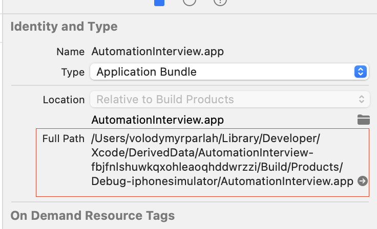

# Hello :)

I built this project with **JavaScript**, **WDIO** as Appium client and **Mocha** as test runner.  

### Before we start you need to install next tools

1. Xcode with desired simulator
2. NodeJS 16 <https://nodejs.org/en/blog/release/v16.16.0/>
3. Appium `npm install -g appium@latest`
4. IOS Appium driver `appium driver install --source=npm appium-xcuitest-driver@4.13.2`

### Then we need to configure project

In the file `config/wdio.appium.ios.conf.js` you'll find next properties

```
"appium:deviceName": "iPhone 13",
"appium:platformVersion": "16.1",
"appium:app": "/path/to/AutomationInterview.zip"
```

1. Update `deviceName` and `platformVersion` based on you simulator

2. As for the app path you can copy it from xcode


### Now we are ready to run the tests

1. First install project dependencies `npm install`
2. Run tests via command `npm run test:e2e`
